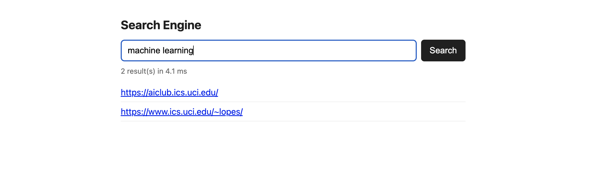

# Search Engine

A disk-backed inverted index, TF-IDF ranking, and a small Flask UI on top. Originally built and tuned against a crawl of roughly 55,000 pages from UCI's ICS domain. A small sample corpus is included so the project runs standalone.

**Stack:** Python, Flask, BeautifulSoup + lxml, NLTK (Porter stemmer), pytest.


*Shown against the included sample corpus — see [Usage](#usage) to point it at a full crawl.*

## How it works

`indexer.py` walks a directory of crawled JSON documents, drops exact and near-duplicates (an MD5 hash for exact matches, a SimHash fingerprint with Hamming-distance comparison for near matches), tokenizes and stems everything with a Porter stemmer, and weights terms by where they show up — title and headings count more than body text. It builds the index in batches and merges them at the end so memory use doesn't scale with corpus size, and writes a byte-offset seek map alongside the postings so a query can jump straight to a term's postings instead of scanning the whole file.

`search_engine.py` loads that seek map and runs boolean AND queries, falling back to OR if AND comes up empty, then ranks results with TF-IDF, field boosts, and a small bonus when query terms show up near each other in a document.

`evaluate.py` runs a set of 23 hand-picked test queries to check both relevance and speed. A few were chosen specifically because they performed poorly:

- Common words like "information" and "the" showed up across most of the corpus and drowned out everything else, so scoring now skips any term appearing in more than 30% of documents.
- Long, low-content pages were winning purely on raw term count, so the term-frequency weight is now normalized by document length.
- Multi-term queries with one missing term used to return nothing under strict AND, so there's an OR fallback now.
- Generic single-word queries needed a push toward the actually-relevant pages, so title/heading matches get a weight boost.

`benchmark.py` reports indexing time and peak memory, plus query latency (mean/p50/p95) across those same 23 queries. `app.py` wraps the whole thing in a small Flask API and search page. Tests live under `tests/`.

One bug worth noting: the original duplicate-detection code checked against a set of seen fingerprints that was never actually being written to, so dedup silently did nothing. Fixing it exposed a second problem — checking every new document against every fingerprint seen so far is O(n²), which is fine at small scale but grinds to a halt on tens of thousands of documents, especially wherever the corpus has large near-identical clusters (old wiki revision history, for example). The fix buckets fingerprints into four 16-bit bands; since the near-duplicate threshold is 3 bits, at least one band is guaranteed to match exactly whenever two fingerprints are close enough, so lookups only need to check same-bucket candidates instead of the whole set.

## Setup

```bash
python3 -m venv venv && source venv/bin/activate
pip install -r requirements.txt
python3 -c "import nltk; nltk.download('punkt_tab')"
```

## Usage

`DEV/` in this repo has a handful of sample pages so the whole pipeline runs out of the box. Build the index from them:

```bash
python3 indexer.py
```

To index a real crawl instead, replace `DEV/` with your own documents (same shape: `{"url": ..., "content": "<html>...</html>"}`, one per `.json` file, in any subfolder structure) and rerun the command above.

Run the evaluation queries:

```bash
python3 evaluate.py
```

Benchmark:

```bash
python3 benchmark.py            # query latency only
python3 benchmark.py --reindex  # also times the indexing run
```

Run tests:

```bash
pytest
```

Run the demo UI:

```bash
python3 app.py
# http://127.0.0.1:5000
```

Once it's running, hitting the API directly returns real results from the sample corpus:

```
$ curl "http://127.0.0.1:5000/search?q=machine+learning"
{
  "query": "machine learning",
  "results": [
    "https://aiclub.ics.uci.edu/",
    "https://www.ics.uci.edu/~lopes/"
  ]
}

$ curl "http://127.0.0.1:5000/search?q=cristina+lopes"
{
  "query": "cristina lopes",
  "results": [
    "https://www.ics.uci.edu/~lopes/"
  ]
}
```

## License

MIT — see [LICENSE](LICENSE).
